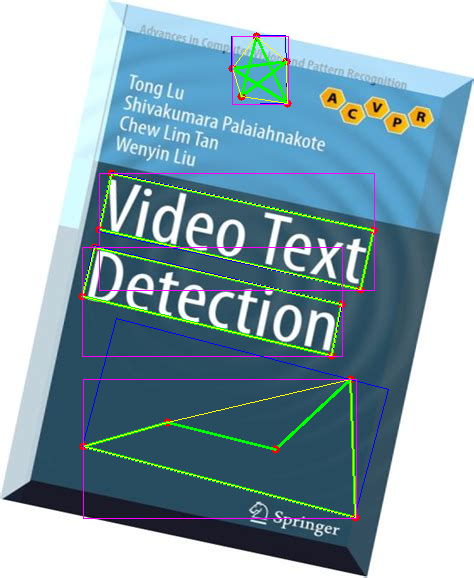

## poly_ROI_selector
It is ROI selector for ROI selection using polygon.

After selected, it generates convex polygon, minimum rotated bounding box and bounding box.

This tool is useful for object annotation, text annotation, object detection, OCR etc.

## Usage
`Left click` Start a new ploygon or add another point

`Right click` Enclose a ploygon

`r` clear all

## example

`Red point`    ->  **user selected points**

`Green line`   ->  **original polygon**

`Yellow line`  ->  **convex polygon**

`blue box`     ->  **minimum rotated bounding box**

`pink box`     ->  **bounding box**

## Dependence
python3, cv2, scipy, numpy

